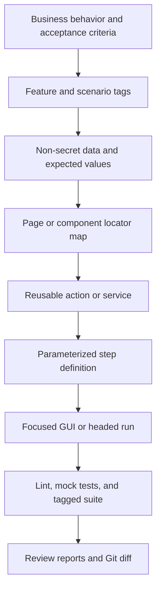
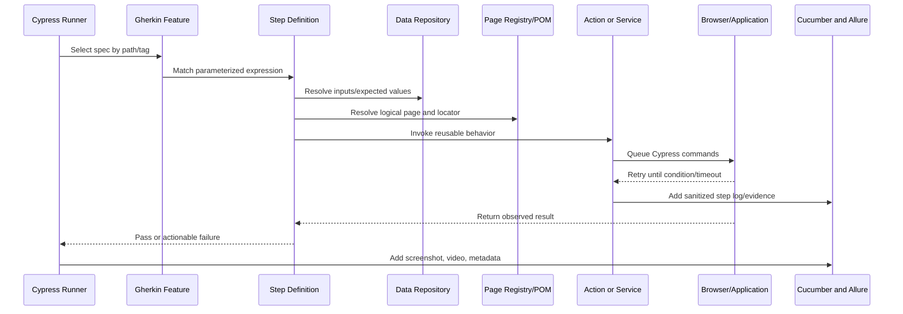
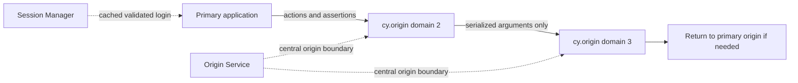
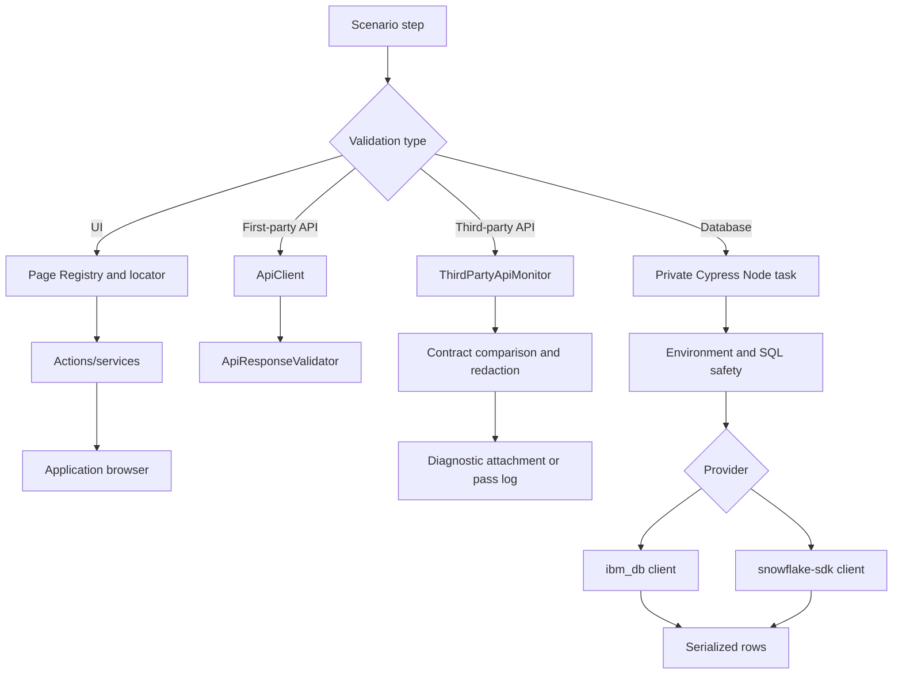
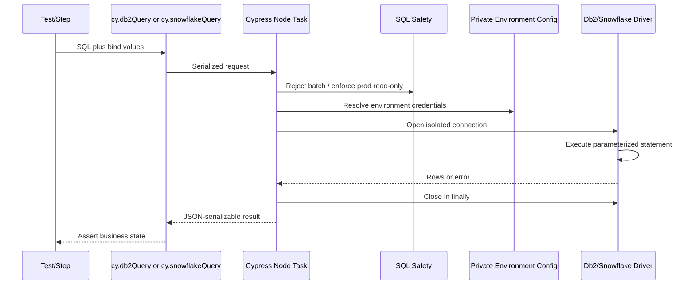
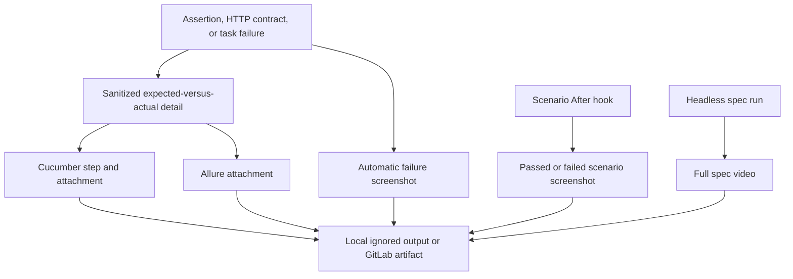
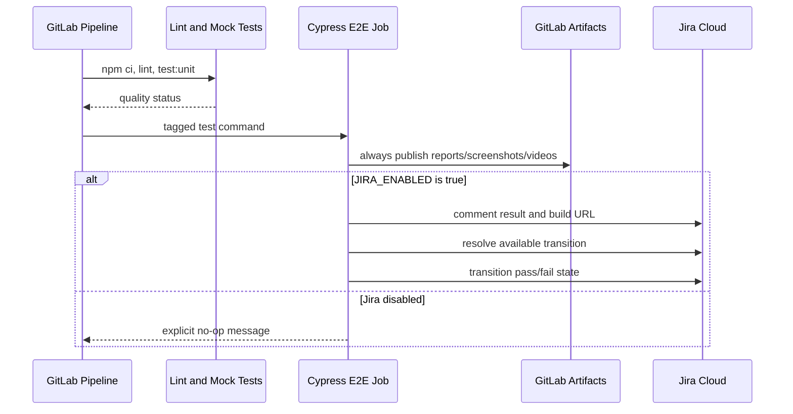

# Framework Flow Diagrams

## Authoring flow

## Runtime flow

## Multi-domain flow in one scenario

## UI, API, and database branches

## Database query lifecycle

## Failure and evidence flow

## CI and Jira flow

